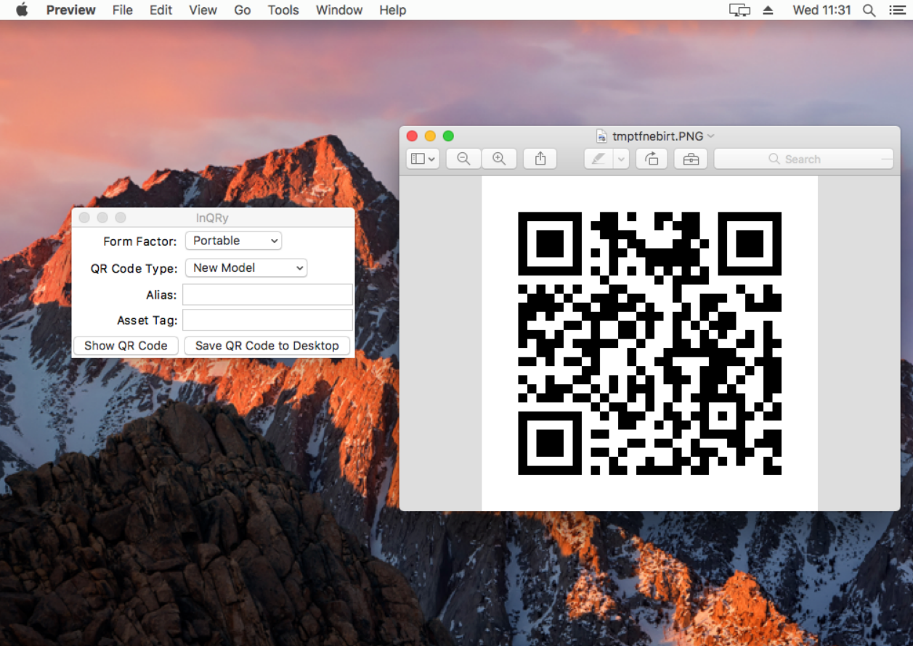

# InQRy

A light-weight, cross-platform utility used to generate a QR code containing hardware specs.

- [About](#about)
- [Supported Platforms](#supported-platforms)
- [Installing from source](#installing-from-source)
- [Building from source](#building-from-source)
    - [macOS](#macos)
    - [Windows](#windows)
- [How It Works](#how-it-works)
- [Usage](#usage)
- [Screenshot](#screenshot)
- [Issue submission](#issue-submission)

### Supported Platforms
- OS X 10.10 or later
- Windows 10
- Windows Server 2012 R2

## About
InQRy is a cross-platform application that generates a single QR code containing the machine's hardware
specifications. This application is designed primarily to be used during a physical inventory procedure.

The QR code contains detailed information about the client machine or device,
which can then be scanned it quickly add assets into a [Snipe-IT](https://github.com/snipe/snipe-it) database.

## Installing from source
### Requirements
- Python 3.4.4 or later

### Instructions
- `pip install .`
- Run: `python InQRy.py`
- Use the InQRy API from the Python interpreter with `from inqry.system_specs import systemspecs`

## Building from source
### macOS
#### Requirements
- ([Homebrew](https://brew.sh/)-installed version of Python 3 (`brew install python3`)
- OS X 10.10 or later (OS X 10.10 is recommended for forward compatibility)
- Xcode Command Line Tools (7.2.0)
- `py2app>=0.12`

#### Instructions
- `python setup.py py2app --iconfile icon/inqry.icns`
- **InQRy.app** is in `dist/`

### Windows
#### Requirements
- Windows 10
- Python 3.4 or 3.5 (32-bit)
    - **Note**: InQRy will **not** build on Python 3.6 or later)
- `pyinstaller>=3.2.1`

#### Instructions
- `pyinstaller --onefile --icon icon/inqry.ico InQRy.py`
- **InQRy.exe** is in `dist/`

## How It Works

InQRy obtains hardware specs using platform-specific shell commands and Python modules. Data is parsed and 
homogenized into a single `SystemSpecs` object, which is passed to a `FormInstructions` object, where data is added and
manipulated to work with the [Snipe-IT](https://github.com/snipe/snipe-it) inventory system. Instructions containing
that data are used to create a [python-qrcode](https://github.com/lincolnloop/python-qrcode)-generated code,
which is displayed on the screen for scanning.

InQRy determines which instructions to follow based on a combination of user input
and the machine itself. Those instructions contain other important information that
allow it to move fluidly through different types of fields in the [Snipe-IT](https://github.com/snipe/snipe-it) asset
entry form.

InQRy was written to obtain asset information quickly and accurately for both
an initial physical inventory procedure, as well as subsequent hardware audits.

### Usage:
```
>>> from inqry.system_specs import systemspecs
>>> ss = systemspecs.SystemSpecs()
>>> ss.os_type
'Darwin'
>>> ss.memory
'8 GB'
>>> ss.storage
{'Drive 1': '251.0 GB SSD (APPLE SSD AP0256J)'}
```

### Screenshot



## Issues
- Create a [GitHub Issue](https://github.com/Microsoft/InQRy/issues/new)
- Send us an email: [apxlab@microsoft.com](mailto:apxlab@microsoft.com)

##### Microsoft Internal Only:
- Submit a VSTS bug: [aka.ms/hubenglabsr](https://office.visualstudio.com/DefaultCollection/APEX/Lab-Support/_dashboards?activeDashboardId=88948f37-eb9b-4b40-a59a-b615aff02d4d)
- Slack (apex-autoinfra.slack.com): **#inqry**

